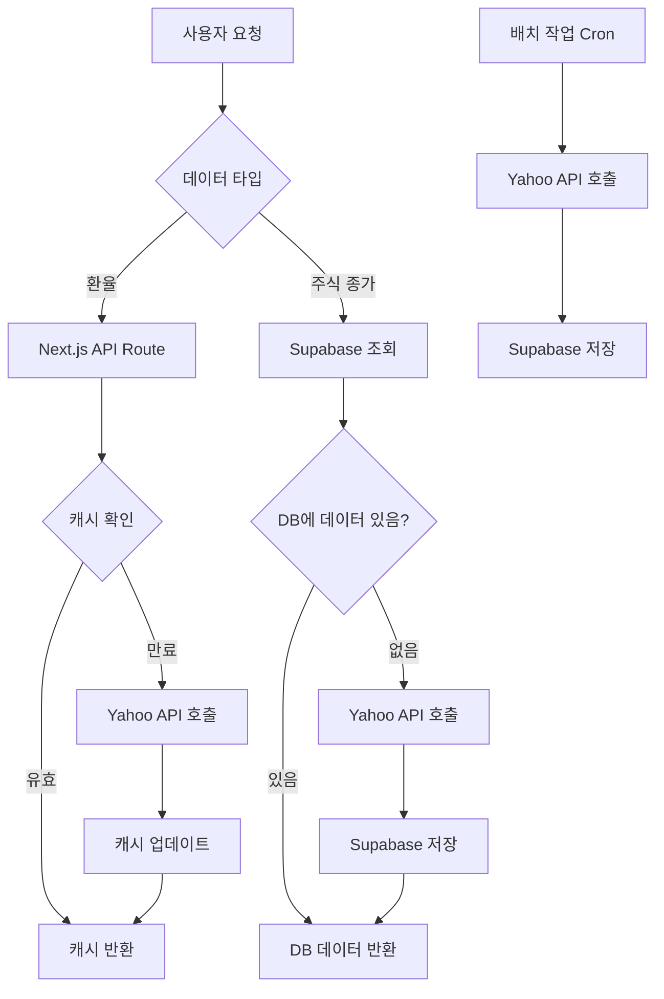

# Supabase 캐싱 및 Next.js Revalidate 구현 계획

## 목표

Yahoo Finance API의 429 (Too Many Requests) 오류를 근본적으로 해결하기 위해 이원화 전략을 구현합니다:

- **환율**: Next.js fetch revalidate로 1시간 캐싱 (서버 사이드)
- **주식 종가**: Supabase에 저장하고 배치 작업으로 수집 (DB 우선 조회)

## 아키텍처 개요




## 구현 단계

### 1. Supabase 설정 및 의존성 추가

**파일**: `package.json`

- `@supabase/supabase-js` 패키지 추가

**파일**: `.env.local` (새로 생성 또는 업데이트)

- `NEXT_PUBLIC_SUPABASE_URL`
- `NEXT_PUBLIC_SUPABASE_ANON_KEY`
- `SUPABASE_SERVICE_ROLE_KEY` (서버 사이드용, 배치 작업)

### 2. Supabase 클라이언트 생성

**파일**: `src/lib/supabase.ts` (새로 생성)

- 클라이언트 사이드 Supabase 클라이언트
- 서버 사이드 Supabase 클라이언트 (Service Role Key 사용)

### 3. Supabase 테이블 스키마 설계

**테이블**: `stock_prices`

```sql
CREATE TABLE stock_prices (
  id UUID PRIMARY KEY DEFAULT gen_random_uuid(),
  symbol TEXT NOT NULL,
  date DATE NOT NULL,
  close_price NUMERIC(15, 4) NOT NULL,
  currency TEXT,
  name TEXT,
  change_percent NUMERIC(10, 4),
  created_at TIMESTAMP WITH TIME ZONE DEFAULT NOW(),
  updated_at TIMESTAMP WITH TIME ZONE DEFAULT NOW(),
  UNIQUE(symbol, date)
);

CREATE INDEX idx_stock_prices_symbol_date ON stock_prices(symbol, date DESC);
```


### 4. 환율 API Route 수정 (Next.js Revalidate)

**파일**: `src/app/api/exchange-rate/route.ts` (새로 생성)

- Next.js `fetch`의 `next: { revalidate: 3600 }` 옵션 사용
- 1시간 동안 캐시 유지
- Yahoo Finance API 직접 호출 (서버 사이드)

**파일**: `src/services/exchangeRate.ts`

- 새로운 API route를 사용하도록 수정
- 클라이언트 사이드 캐싱은 유지 (fallback)

### 5. 주식 Quote API Route 수정 (Supabase 우선)

**파일**: `src/app/api/quote/route.ts`

- Supabase에서 먼저 조회 (오늘 날짜 기준)
- 데이터가 있으면 즉시 반환
- 데이터가 없으면 Yahoo API 호출 후 Supabase에 저장
- Rate limiting 로직은 유지 (Yahoo API 호출 시에만 적용)

**파일**: `src/lib/supabase-quote.ts` (새로 생성)

- Supabase에서 주식 종가 조회 함수
- Supabase에 주식 종가 저장 함수
- 날짜 처리 로직 (장 마감 시간 고려)

### 6. 배치 작업 API Route 생성

**파일**: `src/app/api/cron/update-stock-prices/route.ts` (새로 생성)

- Cron job으로 호출되는 엔드포인트
- 인증: `Authorization` 헤더 또는 Secret Key 확인
- 모든 자산의 티커를 조회하여 종가 수집
- Supabase에 저장 (중복 체크)

**파일**: `src/services/assetStorage.ts`

- 모든 티커를 가져오는 헬퍼 함수 추가

### 7. 설정 파일 업데이트

**파일**: `src/config/app.ts`

- Supabase 관련 설정 추가
- 배치 작업 관련 설정 추가
- 주식 종가 캐시 TTL 설정 (필요시)

## 데이터 흐름

### 환율 조회 흐름

1. 클라이언트 → `/api/exchange-rate` 요청
2. Next.js 서버에서 캐시 확인 (1시간 TTL)
3. 캐시 있음 → 즉시 반환
4. 캐시 없음 → Yahoo API 호출 → 캐시 저장 → 반환

### 주식 종가 조회 흐름

1. 클라이언트 → `/api/quote?symbol=AAPL` 요청
2. 서버에서 Supabase 조회 (오늘 날짜)
3. 데이터 있음 → 즉시 반환
4. 데이터 없음 → Yahoo API 호출 → Supabase 저장 → 반환

### 배치 작업 흐름

1. Cron job → `/api/cron/update-stock-prices` 호출 (매일 아침 7시)
2. 모든 자산의 티커 목록 조회
3. 각 티커에 대해 Yahoo API 호출 (Rate limiting 적용)
4. Supabase에 저장 (중복 체크)

## 주요 변경사항

### 제거/수정할 코드

- `src/app/api/quote/route.ts`의 Rate limiting 로직은 유지하되, Supabase 우선 조회 추가
- `src/services/exchangeRate.ts`는 새로운 API route 사용하도록 수정

### 새로 생성할 파일

- `src/lib/supabase.ts` - Supabase 클라이언트
- `src/lib/supabase-quote.ts` - 주식 종가 DB 조회/저장 로직
- `src/app/api/exchange-rate/route.ts` - 환율 전용 API route
- `src/app/api/cron/update-stock-prices/route.ts` - 배치 작업 API route

## 환경 변수

```bash
# Supabase
NEXT_PUBLIC_SUPABASE_URL=your_supabase_url
NEXT_PUBLIC_SUPABASE_ANON_KEY=your_anon_key
SUPABASE_SERVICE_ROLE_KEY=your_service_role_key

# 배치 작업 인증 (선택사항)
CRON_SECRET=your_cron_secret
```


## 배치 작업 설정 (Vercel Cron 또는 외부 서비스)

Vercel의 경우 `vercel.json`에 cron 설정 추가:

```json
{
  "crons": [{
    "path": "/api/cron/update-stock-prices",
    "schedule": "0 7 * * *"
  }]
}
```